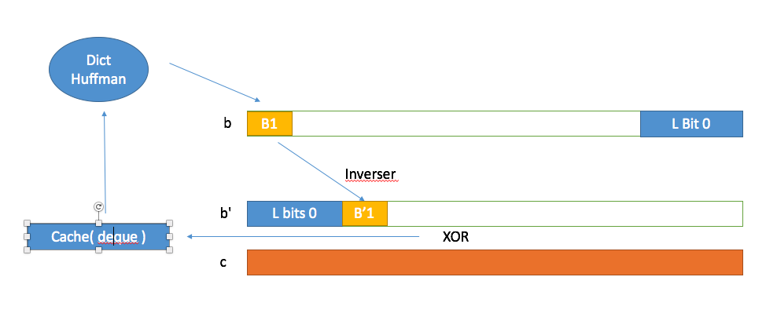

<h1 align="center">DM Un Implémentation sur " Bidirectionally Decodable Streams of Prefix Code-Words"</h1>

<h2 align="center">Introduction</h2>

**Un Prefix Code Word - Huffman:** Le Huffman Code est un Préfix code, c'est-à-dire, il n'existe pas un code-word qui est la préfixe d'un autre code-word. Cette caractéristique nous permet de décoder uniquement dans le sens avancé sans rajouter les autres information.   

**Problématique:** Un bit erreur dans la transmission de données peut mener à une conséquence catastrophique. Tous les codes qui suivent le code bit erreur est inutile. 

**Ancienne Solution:"** Designer une table code qui possède à la fois préfixe et suffixe. La défaillance c'est un perdre de efficacité du codage et du décodage. 

**Nouvelle Solution:"** L'objectif de cette nouvelle façon de décodage c'est de rendre le décodage en double sens possible en respectant l'efficacité. 

<h2 align="center">Demo Programme</h2>

~~~bash
MBP-de-XICUN:DM xicunhan$ python bidirect.py 
----------------------Construction Huffman-------------------------
dic of Frequency:  {'A': 10, 'C': 2, 'B': 4, 'E': 3, 'G': 2, 'F': 9, 
'I': 4, 'H': 6, 'K': 3, 'J': 4, 'M': 9, 'L': 7, 'N': 6, '\n': 1}
dictionary of Code: {'A': '110', 'C': '00011', 'B': '0100', 
'E': '10111', 'G': '10110', 'F': '011', 'I': '0101', 'H': '1110', 
'K': '0000', 'J': '1010', 'M': '100', 'L': '001', 'N': '1111', 
'\n': '00010'}
Maximum Length is : 5
--------------------------------------------------------------------

----------------------Beginning Encodage-------------------------
Code B retrieved: 00011000111011010110101111011110111000000000000010001000100010001
10110110110101010101010101101010101010101001101101101101111101110
11101110111011101111111111111111111111110010010010010010010011001
001001001001001001001001101101101101101101101101101100001000000
Code B' retrieved: 00000110001100001101011011110111101111010000000000000010001000100
010110110110110101010101010101001010101010101011101101101101100111
0111011101110111011111111111111111111111111110010010010010010010000
100100100100100100100100101101101101101101101101101101101000
Code C get:  0001111011011101101111010010100101011101000000001000101010101
01011110110110111000000000000011111000000000001100001101101100101110101
010101010101010100000000000000000000001101100000000000000001011001101101
101101101101101001000000000000000000000000001100101000
-------------------------------------------------------------------

---------------------Le Resultat du decodage forward:-------------------------
CCGGEEEKKKBBBBFFFFIIIIJJJJFFFFFHHHHHHNNNNNNLLLLLLLMMMMMMMMMAAAAAAAAAA
---------------------Le Resultat du decodage backward:------------------------

AAAAAAAAAAMMMMMMMMMLLLLLLLNNNNNNHHHHHHFFFFFJJJJIIIIFFFFBBBBKKKEEEGGCC
------------------------------------------------------------------------------

on va changer 10eme bit du C :
---------------------Le Resultat du decodage forward:-------------------------
CCLMGAFEGAIAANIFHAGAMAIAJBMMBIFKFC
HMMHCACACAFMMBMMIGGKIHIB
B
B
I
---------------------Le Resultat du decodage backward:------------------------

AAAAAAAAAAMMMMMMMMMLLLLLLLNNNNNNHHHHHHFFFFFJJJJIIIIFFFFBBBBKKKEEEGG
M
------------------------------------------------------------------------------
~~~

### La programme est construite en 4 parties
- Construire un arbre Huffman et distribuer le codage pour chaque symbole
- Encoder le texte lu d'un fichier
	- Obtenir le Code B: Codage en sens normal et rajouter les L bits zeros. 
	- OBtenir le Code B': inverser le codage et rajouter L bits zeros à l'avance. 
	- Faire un Xor B et B' et le renvoyer
- Decoder
	- Decoder en sens l'avance 
	- Decoder en sens l'arrière 
- Simulaltion d'erreur
	- Simuler une erreur sur 10ème bit du C
	- redécoder en Deux sens

<h2 align="center">Explication Méthodologie</h2>

La nouvelle façon profite **deux caractéristiques** pour rendre le codage et décodage possible.
 
- A xor B = C; C xor B = A; C xor A = B
- en concaténant L bits, le codage d'un symbole ne couvre pas son codage inversé. 

### Codage: 
- coder chaque mot avec le trie huffman. 
	- sauvegarder chaque code dans une liste nommé b
	- sauvegarder l'inverse de chaque code dans une autre liste nommé b'
- Rajouter les L bits de zéros, où L c'est la longueur maximum dans le trie Huffman. 
	- en rajouter devant le b
	- en rajouter en arrière du b'
- Xor bit à bit le nouveau b et b', renvoyer C. 

### Décodage:

#### Sens "Forward" 
Pour obtenir b, on doit faire Xor de c et b', on ne sait pas ce que c'est b', mais on connait qu'il est commencé de L bits zéro. donc, on peu faire xor de première L bits c avec L bits de 0. On met le résultat dans un deque(collections), et essayer de décoder B1. 

B1 va être décodé, car son longueur est inféreur ou égale à L, en obtenant le B1 et longueur du B1, on peut déduire la longueur du B'1 et son contenu qui est exactement l'inverse du B1. 

On utilise B'1 et Xor avec les bits de C correspondant. ainsi de suite. 

de cette façon, on peut très bien obtenir le b. 

#### Sens "Backward"

Pour obtenir le b', on s'emplois exactement la même logique que b, mais cette fois ci on commence de queue du b et c. et il faut aussi faire attention qu'il faut append les nouveaux contenu de gauche du Cache et le "pop" de droite. 

### le résultat

Supposons qu'il y a un erreur dans le 10 ème bits du c. si on décode que dans le sens forward, évidement, toutes les informations après "CC"(dans l'exemple ci-dessus) sont inutiles. Mais grâce au décodage "backward", on constate, que les informations sont bien conservé grâce à ce système.  
 

